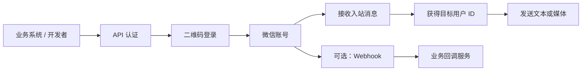
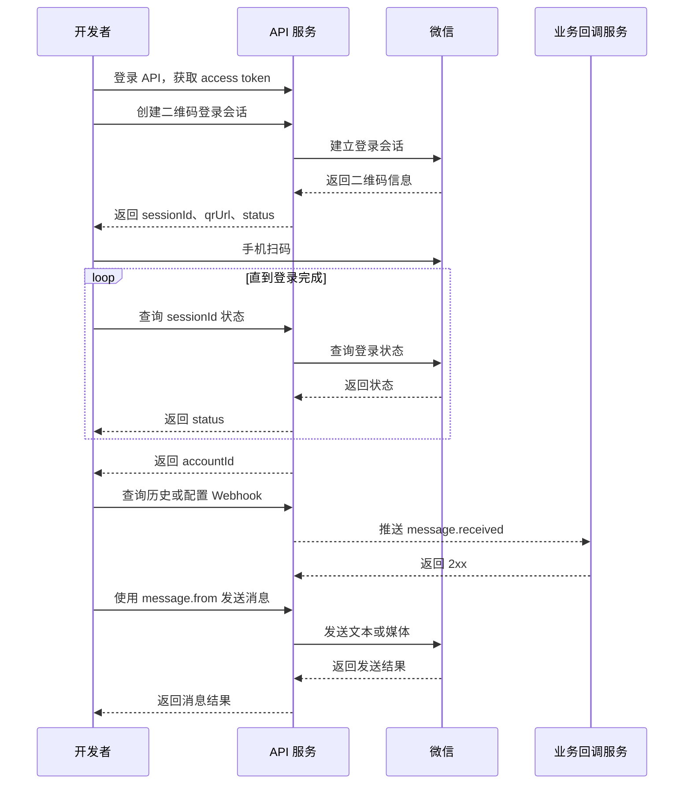

# 微信 iLink API

面向开发者的微信接入 API。业务系统通过 HTTP API 完成 API 用户认证、微信扫码登录、账号管理、消息收发、媒体传输和入站 Webhook，不需要直接处理微信底层连接细节。

服务的微信能力范围与腾讯官方 [openclaw-weixin](https://github.com/Tencent/openclaw-weixin) 当前支持的 iLink 能力保持一致。本文只介绍 API 使用方式，不介绍服务内部实现。

## 你可以用它做什么

- 为一个或多个微信账号创建二维码登录会话。
- 发送和接收文本、图片、视频、文件。
- 查询消息历史，并下载消息中的媒体。
- 通过 Webhook 实时接收入站消息。
- 管理账号状态、暂停或恢复账号。
- 使用 Swagger UI 在线查看并调试接口。

当前文档按单机部署编写。多微信账号可以在同一个 API 服务实例中使用，不需要额外的分布式组件。

## 文档导航

- [快速开始](#快速开始)
- [五分钟完成首次对接](#五分钟完成首次对接)
- [API 参考](docs/weixin-api.md)
- [高级部署与备份](#高级部署与备份)
- [日志与故障排查](#日志与故障排查)

## 快速开始

### 一键部署（推荐）

服务器安装好 Docker 后，只需要执行一条命令：

```bash
curl -fsSL https://raw.githubusercontent.com/OSpoon/wechat-ilink-api/main/install.sh | bash
```

脚本会自动选择最新 Release，下载对应的 Compose 配置，创建 `./wechat-ilink-api`，自动生成并保存 `APP_KEY`，然后拉取镜像并启动 API 和管理控制台。默认不需要登录 GHCR；如果你的镜像仓库是私有的，脚本提示后再执行 `docker login ghcr.io` 即可。

安装完成后：

- API：<http://localhost:13333>
- 管理控制台：<http://localhost:18080>
- Swagger：<http://localhost:13333/docs>

指定版本或目录时：

```bash
curl -fsSL https://raw.githubusercontent.com/OSpoon/wechat-ilink-api/main/install.sh \
  | bash -s -- --version v0.0.1-beta.2 --dir /opt/wechat-ilink-api
```

常用运维命令：

```bash
cd wechat-ilink-api
docker compose logs -f api  # 查看 API 日志
docker compose down         # 停止服务
```

### 本地开发

本地开发需要 Node.js 24、pnpm 10：

```bash
corepack enable
pnpm install
cp .env.example .env
node ace.js migration:run
pnpm dev
pnpm dev:admin
```

开发环境的 `.env` 需要设置 `APP_KEY`；可以执行 `openssl rand -hex 32` 生成。生产环境请使用上面的一键部署脚本。

## 五分钟完成首次对接

下面只使用最常用的几个接口。假设服务运行在 http://localhost:13333。

### 1. 获取 API 访问令牌

开发环境默认提供一个 API 测试账号，可以跳过注册：

```text
邮箱：test@example.com
密码：test12345678
```

```bash
API_URL=http://localhost:13333

curl -X POST "$API_URL/api/v1/auth/login" \
  -H 'Content-Type: application/json' \
  -d '{"email":"test@example.com","password":"test12345678"}'
```

从响应的 data.token 取出令牌：

```bash
ACCESS_TOKEN='oat_xxx'
```

令牌后续通过 Bearer 方式传递：

```http
Authorization: Bearer oat_xxx
```

### 2. 创建微信二维码登录会话

```bash
curl -i -X POST "$API_URL/api/v1/weixin/login-sessions" \
  -H "Authorization: Bearer $ACCESS_TOKEN"
```

响应状态为 202，响应体仍然包含 JSON 数据。记下 data.id（sessionId）和 data.qrUrl：

```json
{
  "data": {
    "id": "wxlogin_xxx",
    "status": "waiting_scan",
    "qrUrl": "https://...",
    "expiresAt": "2026-09-05T12:00:00.000Z"
  }
}
```

在手机微信中扫描 qrUrl 对应的二维码。

### 3. 轮询登录状态

```bash
curl "$API_URL/api/v1/weixin/login-sessions/wxlogin_xxx" \
  -H "Authorization: Bearer $ACCESS_TOKEN"
```

每隔约 1 秒查询一次，直到 status 为 confirmed 或 already_connected。成功后从 data.accountId 取出账号 ID：

```bash
ACCOUNT_ID='wxacc_xxx'
```

如果状态变为 need_verifycode，按“提交安全验证码”操作。如果二维码失效，重新创建登录会话即可。

### 4. 找到目标用户 ID

发送消息的 to 必须是微信 iLink 用户 ID。最简单的方式是让目标用户先向该微信账号发送一条消息，再查询历史：

```bash
curl "$API_URL/api/v1/weixin/accounts/$ACCOUNT_ID/messages?limit=20" \
  -H "Authorization: Bearer $ACCESS_TOKEN"
```

在入站消息中取 message.from，作为后续发送请求的 to。使用 Webhook 时，也可以取事件中的 message.from。

### 5. 发送文本

```bash
curl -X POST "$API_URL/api/v1/weixin/accounts/$ACCOUNT_ID/messages" \
  -H "Authorization: Bearer $ACCESS_TOKEN" \
  -H 'Content-Type: application/json' \
  -d '{"to":"user_xxx","text":"你好，这是一条测试消息"}'
```

至此已完成一次真实微信消息对接。媒体、输入状态和 Webhook 都是按需启用的可选能力。

## 核心概念

| 名称            | 用途                                                  |
| --------------- | ----------------------------------------------------- |
| access token    | API 用户登录后获得的访问令牌，用于调用受保护接口      |
| sessionId       | 一次二维码登录会话的 ID，用于查询、验证或取消本次登录 |
| accountId       | 登录成功后的微信账号 ID，所有账号级接口都需要它       |
| 目标用户 ID     | 发送消息时的 to；通常从入站消息的 from 获得           |
| contextToken    | 可选的会话上下文。通常省略，由服务自动使用已知上下文  |
| clientMessageId | 调用方生成的消息关联 ID，便于业务侧追踪               |
| runId           | 调用方生成的业务链路 ID，便于把一组请求关联起来       |

sessionId 和 accountId 是两个不同的值：前者属于一次临时登录过程，后者属于登录成功后可长期使用的微信账号。

## 业务调用流程

### 模块关系



### 调用泳道图



## API 约定

### 基础地址

本文示例使用：

```bash
API_URL=http://localhost:13333
```

部署到其他环境时，只需要替换 API_URL。

### 认证

除健康检查、Swagger 和认证接口外，API 接口都需要：

```http
Authorization: Bearer <access-token>
```

### 请求与响应

- JSON 请求使用 Content-Type: application/json。
- 成功的对象响应通常使用 data 包裹。
- 列表响应为 data 数组。
- 健康检查返回直接的 JSON 对象。
- 媒体下载接口返回二进制内容，不是 JSON。
- 登录会话创建接口返回 HTTP 202，但响应体包含登录会话数据。
- 时间统一使用 ISO 8601 格式。

示例成功响应：

```json
{
  "data": {
    "id": "wxmsg_xxx",
    "status": "sent"
  }
}
```

## 认证

### 注册 API 用户

如果没有可用账号，调用注册接口：

```bash
curl -X POST "$API_URL/api/v1/auth/signup" \
  -H 'Content-Type: application/json' \
  -d '{
    "fullName": "Your Name",
    "email": "you@example.com",
    "password": "change-me-123456",
    "passwordConfirmation": "change-me-123456"
  }'
```

### 登录

```bash
curl -X POST "$API_URL/api/v1/auth/login" \
  -H 'Content-Type: application/json' \
  -d '{"email":"you@example.com","password":"change-me-123456"}'
```

### 查看当前用户

```bash
curl "$API_URL/api/v1/account/profile" \
  -H "Authorization: Bearer $ACCESS_TOKEN"
```

### 退出登录

```bash
curl -X POST "$API_URL/api/v1/account/logout" \
  -H "Authorization: Bearer $ACCESS_TOKEN"
```

## 微信账号接入

### 创建二维码登录会话

```http
POST /api/v1/weixin/login-sessions
```

无请求体。响应中的关键字段：

| 字段           | 说明                               |
| -------------- | ---------------------------------- |
| data.id        | 本次登录的 sessionId               |
| data.qrUrl     | 在手机微信中打开或展示的二维码地址 |
| data.status    | 当前登录状态                       |
| data.accountId | 登录成功后返回的微信账号 ID        |

### 查询登录状态

```http
GET /api/v1/weixin/login-sessions/:sessionId
```

建议客户端轮询该接口，而不是依赖固定等待时间。

### 提交安全验证码

当状态为 need_verifycode 时，微信可能要求提交数字验证码：

```bash
curl -X POST "$API_URL/api/v1/weixin/login-sessions/wxlogin_xxx/verify" \
  -H "Authorization: Bearer $ACCESS_TOKEN" \
  -H 'Content-Type: application/json' \
  -d '{"code":"123456"}'
```

验证码由微信登录流程显示或提示。提交后继续查询同一个 sessionId。

### 取消二维码登录

只有不再需要本次登录时才需要取消：

```bash
curl -X DELETE "$API_URL/api/v1/weixin/login-sessions/wxlogin_xxx" \
  -H "Authorization: Bearer $ACCESS_TOKEN"
```

### 查询账号

```bash
curl "$API_URL/api/v1/weixin/accounts" \
  -H "Authorization: Bearer $ACCESS_TOKEN"

curl "$API_URL/api/v1/weixin/accounts/$ACCOUNT_ID" \
  -H "Authorization: Bearer $ACCESS_TOKEN"
```

一个 API 用户可以绑定多个微信账号。每绑定一个微信，就创建一次登录会话；之后使用各自的 accountId 调用消息接口。

### 启动与停止账号

```bash
curl -X POST "$API_URL/api/v1/weixin/accounts/$ACCOUNT_ID/start" \
  -H "Authorization: Bearer $ACCESS_TOKEN"

curl -X POST "$API_URL/api/v1/weixin/accounts/$ACCOUNT_ID/stop" \
  -H "Authorization: Bearer $ACCESS_TOKEN"
```

账号登录成功后通常已经可以接收消息，不需要立即调用 start。stop 用于暂时暂停该账号的消息接收，start 用于恢复。正常业务流程不需要主动 stop；只有需要暂停某个账号接收消息时才调用。

## 消息收发

### 发送文本

```http
POST /api/v1/weixin/accounts/:accountId/messages
Content-Type: application/json
```

```json
{
  "to": "user_xxx",
  "text": "你好，来自 API 服务",
  "clientMessageId": "client-message-001",
  "runId": "run-001"
}
```

字段说明：

| 字段            | 必填 | 说明                                        |
| --------------- | ---- | ------------------------------------------- |
| to              | 是   | 目标微信 iLink 用户 ID，来自入站消息的 from |
| text            | 是   | 要发送的文本                                |
| contextToken    | 否   | 需要指定会话上下文时传入；普通场景省略      |
| clientMessageId | 否   | 调用方自定义关联 ID，建议每次请求使用唯一值 |
| runId           | 否   | 调用方自定义的业务链路 ID                   |

curl 示例：

```bash
curl -X POST "$API_URL/api/v1/weixin/accounts/$ACCOUNT_ID/messages" \
  -H "Authorization: Bearer $ACCESS_TOKEN" \
  -H 'Content-Type: application/json' \
  -d '{
    "to": "user_xxx",
    "text": "你好，来自 API 服务",
    "clientMessageId": "client-message-001",
    "runId": "run-001"
  }'
```

### 发送图片、视频或文件

接口使用 multipart/form-data：

```bash
curl -X POST "$API_URL/api/v1/weixin/accounts/$ACCOUNT_ID/messages/media" \
  -H "Authorization: Bearer $ACCESS_TOKEN" \
  -F "file=@./demo.jpg" \
  -F "to=user_xxx" \
  -F "mediaType=image" \
  -F "caption=图片说明" \
  -F "clientMessageId=media-message-001" \
  -F "runId=run-001"
```

字段说明：

| 字段            | 必填 | 可用值或说明                     |
| --------------- | ---- | -------------------------------- |
| file            | 是   | 要发送的文件，单个文件最大 20 MB |
| to              | 是   | 目标微信 iLink 用户 ID           |
| mediaType       | 是   | image、video、file               |
| caption         | 否   | 媒体说明文字                     |
| contextToken    | 否   | 指定会话上下文时使用             |
| clientMessageId | 否   | 调用方自定义关联 ID              |
| runId           | 否   | 调用方自定义业务链路 ID          |

服务会根据 mediaType 处理媒体。调用方不需要自行准备微信媒体协议字段。

### 发送输入状态

```bash
curl -X POST "$API_URL/api/v1/weixin/accounts/$ACCOUNT_ID/typing" \
  -H "Authorization: Bearer $ACCESS_TOKEN" \
  -H 'Content-Type: application/json' \
  -d '{"to":"user_xxx","status":1}'
```

status 取值：

- 1：正在输入
- 2：取消输入

## 接收入站消息

### 查询消息历史

```bash
curl "$API_URL/api/v1/weixin/accounts/$ACCOUNT_ID/messages?limit=50" \
  -H "Authorization: Bearer $ACCESS_TOKEN"
```

limit 范围为 1 到 100。响应中的消息通常包含：

| 字段       | 说明                |
| ---------- | ------------------- |
| id         | API 消息 ID         |
| direction  | inbound 或 outbound |
| from       | 消息发送方 ID       |
| to         | 消息接收方 ID       |
| payload    | 消息内容            |
| media      | 媒体项列表          |
| receivedAt | 入站时间            |
| sentAt     | 出站时间            |

示例：

```json
{
  "data": [
    {
      "id": "wxmsg_xxx",
      "direction": "inbound",
      "from": "user_xxx",
      "to": "wxuser_xxx",
      "status": "received",
      "payload": {
        "item_list": [
          {
            "type": 1,
            "text": "你好"
          }
        ]
      },
      "media": [],
      "receivedAt": "2026-09-05T10:00:00.000Z"
    }
  ]
}
```

### 下载消息媒体

当消息的 media 中存在 itemIndex 和 url 时，可下载入站或出站消息中的媒体：

```bash
curl "$API_URL/api/v1/weixin/accounts/$ACCOUNT_ID/messages/$MESSAGE_ID/media/0" \
  -H "Authorization: Bearer $ACCESS_TOKEN" \
  -o received-media.bin
```

接收媒体从微信 CDN 下载并解密后返回二进制内容；发送媒体使用 API 服务保存的本地副本返回。出站媒体不会再次请求微信 CDN，因为微信当前返回的出站下载参数无法用于下载。根据响应的 Content-Type 或文件内容保存为合适的扩展名。

### 配置 Webhook

Webhook 用于将入站消息实时通知到业务系统。当前支持的事件为 message.received。

创建 Webhook：

```bash
curl -X POST "$API_URL/api/v1/weixin/webhooks" \
  -H "Authorization: Bearer $ACCESS_TOKEN" \
  -H 'Content-Type: application/json' \
  -d '{
    "accountId": "wxacc_xxx",
    "url": "https://your-app.example.com/hooks/weixin",
    "secret": "replace-with-at-least-16-chars",
    "events": ["message.received"]
  }'
```

secret 是 API 服务用于签名 Webhook 的共享密钥，由业务系统生成并保存。长度至少 16 个字符；不要填写空字符串。API 服务不会要求业务系统额外调用 secret 接口。

查询和删除：

```bash
curl "$API_URL/api/v1/weixin/webhooks" \
  -H "Authorization: Bearer $ACCESS_TOKEN"

curl -X DELETE "$API_URL/api/v1/weixin/webhooks/$WEBHOOK_ID" \
  -H "Authorization: Bearer $ACCESS_TOKEN"
```

删除后不会再产生新的投递；已经产生的投递记录仍可用于排查。

### 接收 Webhook

请求方法为 POST，body 为 JSON。示例：

```json
{
  "id": "wxmsg_xxx",
  "type": "message.received",
  "createdAt": "2026-09-05T10:00:00.000Z",
  "accountId": "wxacc_xxx",
  "message": {
    "id": "wxmsg_xxx",
    "from": "user_xxx",
    "to": "wxuser_xxx",
    "payload": {
      "item_list": [
        {
          "type": 1,
          "text": "你好"
        }
      ]
    },
    "receivedAt": "2026-09-05T10:00:00.000Z"
  }
}
```

请求头：

```http
X-Weixin-Event: message.received
X-Weixin-Delivery: delivery_xxx
X-Weixin-Signature: sha256=<hex-signature>
```

业务系统应使用完整的原始请求 body 和创建 Webhook 时的 secret 计算 HMAC-SHA256，再与 X-Weixin-Signature 比较。应先验签，再解析 JSON。

Node.js 验签示例：

```js
import { createHmac, timingSafeEqual } from 'node:crypto'

export function verifyWebhook(rawBody, signature, secret) {
  const expected = 'sha256=' + createHmac('sha256', secret).update(rawBody).digest('hex')
  const actualBuffer = Buffer.from(signature ?? '')
  const expectedBuffer = Buffer.from(expected)

  return (
    actualBuffer.length === expectedBuffer.length && timingSafeEqual(actualBuffer, expectedBuffer)
  )
}
```

业务回调成功处理后返回任意 2xx 状态码。可以通过下面的接口查询投递记录：

```bash
curl "$API_URL/api/v1/weixin/webhooks/$WEBHOOK_ID/deliveries" \
  -H "Authorization: Bearer $ACCESS_TOKEN"
```

## 状态与错误

### 登录会话状态

| 状态              | 含义             | 建议操作               |
| ----------------- | ---------------- | ---------------------- |
| waiting_scan      | 等待扫码         | 展示二维码并继续查询   |
| scanned           | 已扫码，等待确认 | 继续查询               |
| need_verifycode   | 需要安全验证码   | 调用 verify 接口       |
| verifying         | 验证处理中       | 继续查询，不要重复提交 |
| confirmed         | 登录成功         | 使用 accountId         |
| already_connected | 账号已经连接     | 使用返回的 accountId   |
| failed            | 登录失败         | 重新创建会话           |
| expired           | 二维码过期       | 重新创建会话           |
| cancelled         | 会话已取消       | 重新创建会话           |

### 微信账号状态

| 状态            | 含义         | 建议操作                 |
| --------------- | ------------ | ------------------------ |
| stopped         | 已暂停       | 需要接收消息时调用 start |
| starting        | 启动中       | 稍后查询                 |
| running         | 可用         | 正常调用消息接口         |
| reauth_required | 需要重新登录 | 创建新的二维码登录会话   |
| error           | 账号异常     | 查询账号详情和服务日志   |

### 消息和投递状态

| 字段                    | 可用值                     |
| ----------------------- | -------------------------- |
| direction               | inbound、outbound          |
| message.status          | received、sent、failed     |
| webhook delivery.status | pending、delivered、failed |
| mediaType               | image、video、file         |

### 错误响应

```json
{
  "error": {
    "code": "E_VALIDATION_ERROR",
    "message": "Validation failure"
  }
}
```

常见错误：

| code                      | 说明                                            |
| ------------------------- | ----------------------------------------------- |
| E_VALIDATION_ERROR        | 请求参数不符合要求，详细字段错误通常位于 errors |
| LOGIN_SESSION_NOT_FOUND   | sessionId 不存在或不属于当前用户                |
| LOGIN_SESSION_NOT_WAITING | 当前登录会话不再接受该操作                      |
| INVALID_VERIFY_CODE       | 安全验证码错误                                  |
| WEIXIN_ACCOUNT_NOT_FOUND  | accountId 不存在或不属于当前用户                |
| WEIXIN_REAUTH_REQUIRED    | 微信账号需要重新扫码登录                        |
| MEDIA_FILE_REQUIRED       | 未上传 file                                     |
| MEDIA_FILE_INVALID        | 文件格式或大小不符合要求                        |
| MESSAGE_NOT_FOUND         | 消息不存在                                      |
| MEDIA_ITEM_NOT_FOUND      | 消息中不存在指定媒体项                          |
| LOCAL_MEDIA_UNAVAILABLE   | 出站媒体没有可用的本地副本                      |
| LOCAL_MEDIA_READ_FAILED   | 出站媒体本地文件读取失败                        |
| WEBHOOK_NOT_FOUND         | Webhook 不存在或不属于当前用户                  |
| INVALID_WEBHOOK_URL       | Webhook URL 不是有效的 HTTPS 地址               |

遇到 401 时先重新登录获取 access token；遇到 403 或资源不存在时，确认资源是否属于当前 API 用户。

## 高级部署与备份

一键脚本已经覆盖大多数单机部署场景。只有需要改端口、绑定域名或使用本地源码构建时，才需要手动编辑 `.env` 或 Compose 文件。

### 重要配置

| 配置                         | 说明                                  |
| ---------------------------- | ------------------------------------- |
| APP_KEY                      | 服务加密密钥，必须长期保存            |
| APP_URL                      | 服务对外访问地址                      |
| PORT                         | API 服务端口，默认 13333              |
| DB_DATABASE                  | SQLite 文件路径，默认 data/db.sqlite3 |
| MEDIA_STORAGE_PATH           | 出站媒体目录，默认 data/media         |
| DEFAULT_TEST_ACCOUNT_ENABLED | 是否创建开发测试账号                  |

通常只需修改 `.env` 中的 `APP_URL` 和端口映射。不要更换已运行服务的 `APP_KEY`，也不要提交 `.env`、数据库文件或 Webhook secret。

### 本地构建镜像

克隆仓库后，可以使用本地 Dockerfile 构建并启动：

```bash
cp .env.example .env
openssl rand -hex 32 # 将结果填入 .env 的 APP_KEY
docker compose up -d --build
```

### 数据备份

至少备份 `data/db.sqlite3`、`data/media/`、`.env` 中的 `APP_KEY` 以及业务侧保存的 Webhook secret。`APP_KEY` 与数据库必须成套备份，否则无法恢复已保存的账号连接信息。

## 日志与故障排查

服务会为每个 HTTP 请求输出一条结构化访问日志，默认写到标准输出。日志服务可以直接采集容器 stdout，不需要读取应用目录中的日志文件。

典型日志字段包括：

| 字段            | 说明                                            |
| --------------- | ----------------------------------------------- |
| event           | 固定为 http.request                             |
| requestId       | 请求关联 ID，同时会通过 X-Request-Id 响应头返回 |
| method          | HTTP 方法                                       |
| path            | 请求路径，不包含查询参数                        |
| route           | 匹配到的路由                                    |
| statusCode      | HTTP 响应状态码                                 |
| durationMs      | 请求处理耗时，单位为毫秒                        |
| userId          | 已认证 API 用户 ID                              |
| accountId       | 请求涉及的微信账号 ID（如果有）                 |
| clientIp        | 客户端 IP                                       |
| requestHeaders  | 请求头，敏感请求头已脱敏                        |
| requestQuery    | 查询参数，敏感字段已脱敏                        |
| requestBody     | 解析后的请求体，敏感字段已脱敏                  |
| responseHeaders | 响应头，Set-Cookie 等敏感响应头已脱敏           |
| responseBody    | 响应正文，敏感字段已脱敏                        |

日志会记录完整的结构化请求和响应元数据、查询参数以及 JSON/表单正文。密码、Cookie、Authorization、令牌、secret、签名、二维码地址等敏感字段会自动脱敏；multipart 上传只记录文件名、类型和大小，不记录文件内容。日志级别和正文开关通过 .env 设置：

- development：默认以便于本地阅读的格式输出。
- production：输出 JSON，适合 Docker、ELK、Loki、云日志等采集系统。
- info：记录正常请求；4xx 请求使用 warn，5xx 请求使用 error。
- REQUEST_LOG_BODY=false：关闭请求和响应正文记录，只保留请求/响应元数据。
- REQUEST_LOG_MAX_BODY_BYTES：单条正文的最大记录大小，超出后保留截断预览。

本地查看请求日志：

```bash
LOG_LEVEL=info pnpm dev
```

Docker 查看请求日志：

```bash
docker compose logs -f api
```

排查某一次请求时，可以在请求中主动传入 X-Request-Id，然后同时搜索该值对应的访问日志：

```bash
curl -i "$API_URL/health/ready" \
  -H 'X-Request-Id: diagnose-20260905-001'
```

## 故障排查

### 登录接口返回空对象

请确认使用的是最新服务进程，并用 curl -i 查看状态码和响应头。创建登录会话的正确响应是 HTTP 202 加 JSON body，登录会话数据位于 data.id、data.qrUrl 和 data.status。

### 不知道 sessionId 在哪里

sessionId 就是创建二维码接口响应中的 data.id，不是 accountId。后续查询、提交验证码和取消二维码都使用这个值。

### 不知道 to 怎么填

to 使用目标用户的 iLink ID。让对方先发消息，然后从消息历史或 Webhook 事件的 message.from 复制。

### 创建 Webhook 报验证错误

secret 不能为空，至少 16 个字符；events 至少包含一个当前支持的事件，例如 message.received；url 应使用 HTTPS。

### 账号变为 reauth_required

微信连接需要重新授权。创建新的二维码登录会话，用真实微信扫码完成重新登录。

### Docker 无法访问

确认端口映射为 13333:13333，容器状态为 healthy，并检查：

```bash
docker compose ps
docker compose logs --tail=200 api
curl http://localhost:13333/health/ready
```

## 接口总览

### 公共接口

| 方法 | 路径          | 用途         |
| ---- | ------------- | ------------ |
| GET  | /             | 服务信息     |
| GET  | /health/live  | 存活检查     |
| GET  | /health/ready | 就绪检查     |
| GET  | /docs         | Swagger UI   |
| GET  | /openapi.json | OpenAPI 文档 |

### 认证接口

| 方法 | 路径                    | 用途                    |
| ---- | ----------------------- | ----------------------- |
| POST | /api/v1/auth/signup     | 注册 API 用户           |
| POST | /api/v1/auth/login      | 登录并获取 access token |
| GET  | /api/v1/account/profile | 查看当前用户            |
| POST | /api/v1/account/logout  | 退出登录                |

### 微信账号与消息接口

| 方法   | 路径                                                                    | 用途               |
| ------ | ----------------------------------------------------------------------- | ------------------ |
| POST   | /api/v1/weixin/login-sessions                                           | 创建二维码登录会话 |
| GET    | /api/v1/weixin/login-sessions/:sessionId                                | 查询二维码状态     |
| POST   | /api/v1/weixin/login-sessions/:sessionId/verify                         | 提交安全验证码     |
| DELETE | /api/v1/weixin/login-sessions/:sessionId                                | 取消二维码登录     |
| GET    | /api/v1/weixin/accounts                                                 | 查询账号列表       |
| GET    | /api/v1/weixin/accounts/:accountId                                      | 查询账号详情       |
| POST   | /api/v1/weixin/accounts/:accountId/start                                | 启动账号           |
| POST   | /api/v1/weixin/accounts/:accountId/stop                                 | 停止账号           |
| GET    | /api/v1/weixin/accounts/:accountId/messages                             | 查询消息历史       |
| POST   | /api/v1/weixin/accounts/:accountId/messages                             | 发送文本           |
| POST   | /api/v1/weixin/accounts/:accountId/messages/media                       | 发送媒体           |
| GET    | /api/v1/weixin/accounts/:accountId/messages/:messageId/media/:itemIndex | 下载消息媒体       |
| POST   | /api/v1/weixin/accounts/:accountId/typing                               | 发送或取消输入状态 |

### Webhook 接口

| 方法   | 路径                                          | 用途         |
| ------ | --------------------------------------------- | ------------ |
| GET    | /api/v1/weixin/webhooks                       | 查询 Webhook |
| POST   | /api/v1/weixin/webhooks                       | 创建 Webhook |
| GET    | /api/v1/weixin/webhooks/:webhookId/deliveries | 查询投递记录 |
| DELETE | /api/v1/weixin/webhooks/:webhookId            | 删除 Webhook |

## 许可证

本项目采用 [MIT License](LICENSE) 开源。
