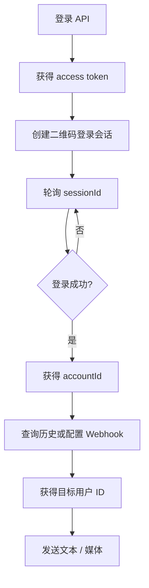

# 微信 iLink API 参考

本文面向 API 使用者，帮助开发者快速找到接口和调用顺序。服务内部的连接、同步、存储和媒体处理细节不在本文说明。

完整的可执行接口文档请打开：

- Swagger UI：/docs
- OpenAPI JSON：/openapi.json
- 使用教程：[项目 README](../README.md)

## 推荐调用顺序



最小闭环是：

1. 调用登录接口获得 access token。
2. 创建二维码登录会话，获得 sessionId 和 qrUrl。
3. 手机微信扫码，轮询 sessionId。
4. 登录成功后使用 accountId。
5. 从入站消息的 from 获得目标用户 ID。
6. 调用消息接口发送文本或媒体。

## 认证

除公共接口外，调用时携带：

```http
Authorization: Bearer <access-token>
```

开发环境默认测试账号：

```text
test@example.com
test12345678
```

正式环境建议通过 POST /api/v1/auth/signup 创建 API 用户。测试账号只代表 API 访问权限，仍然需要使用真实微信完成二维码登录。

## 接口速查

### 登录与账号

| 方法   | 路径                                            | 说明                   |
| ------ | ----------------------------------------------- | ---------------------- |
| POST   | /api/v1/weixin/login-sessions                   | 创建二维码登录会话     |
| GET    | /api/v1/weixin/login-sessions/:sessionId        | 查询登录状态           |
| POST   | /api/v1/weixin/login-sessions/:sessionId/verify | 提交安全验证码         |
| DELETE | /api/v1/weixin/login-sessions/:sessionId        | 取消登录会话           |
| GET    | /api/v1/weixin/accounts                         | 查询当前用户的微信账号 |
| GET    | /api/v1/weixin/accounts/:accountId              | 查询账号详情           |
| POST   | /api/v1/weixin/accounts/:accountId/start        | 恢复账号               |
| POST   | /api/v1/weixin/accounts/:accountId/stop         | 暂停账号               |

一个 API 用户可以绑定多个微信账号。每个微信账号使用独立的 accountId。

### 消息与媒体

| 方法 | 路径                                                                    | 说明                 |
| ---- | ----------------------------------------------------------------------- | -------------------- |
| GET  | /api/v1/weixin/accounts/:accountId/messages                             | 查询消息历史         |
| POST | /api/v1/weixin/accounts/:accountId/messages                             | 发送文本             |
| POST | /api/v1/weixin/accounts/:accountId/messages/media                       | 发送图片、视频或文件 |
| GET  | /api/v1/weixin/accounts/:accountId/messages/:messageId/media/:itemIndex | 下载入站媒体         |
| POST | /api/v1/weixin/accounts/:accountId/typing                               | 发送或取消输入状态   |

发送文本的最小请求：

```json
{
  "to": "user_xxx",
  "text": "你好"
}
```

to 使用目标用户的 iLink ID，通常从入站消息的 from 字段复制。媒体发送使用 multipart/form-data，mediaType 支持 image、video、file。

### Webhook

| 方法   | 路径                                          | 说明         |
| ------ | --------------------------------------------- | ------------ |
| GET    | /api/v1/weixin/webhooks                       | 查询 Webhook |
| POST   | /api/v1/weixin/webhooks                       | 创建 Webhook |
| GET    | /api/v1/weixin/webhooks/:webhookId/deliveries | 查询投递记录 |
| DELETE | /api/v1/weixin/webhooks/:webhookId            | 删除 Webhook |

当前事件：

```json
["message.received"]
```

创建示例：

```json
{
  "accountId": "wxacc_xxx",
  "url": "https://your-app.example.com/hooks/weixin",
  "secret": "replace-with-at-least-16-chars",
  "events": ["message.received"]
}
```

secret 由业务系统生成并保存，至少 16 个字符。投递请求包含以下请求头：

```http
X-Weixin-Event: message.received
X-Weixin-Delivery: delivery_xxx
X-Weixin-Signature: sha256=<hex-signature>
```

业务系统应使用原始请求 body 和 secret 计算 HMAC-SHA256 后验签，再解析 JSON。删除 Webhook 后不会再产生新的投递，历史投递记录仍可查询。

## 状态速查

| 对象         | 字段      | 可用值                                                                                                      |
| ------------ | --------- | ----------------------------------------------------------------------------------------------------------- |
| 登录会话     | status    | waiting_scan、scanned、need_verifycode、verifying、confirmed、already_connected、failed、expired、cancelled |
| 微信账号     | status    | stopped、starting、running、reauth_required、error                                                          |
| 消息         | direction | inbound、outbound                                                                                           |
| 消息         | status    | received、sent、failed                                                                                      |
| Webhook 投递 | status    | pending、delivered、failed                                                                                  |
| 输入状态     | status    | 1 正在输入、2 取消输入                                                                                      |

当账号为 reauth_required 时，需要重新创建二维码登录会话。正常使用时，登录成功后的账号通常可以直接调用消息接口；start/stop 仅用于手动恢复或暂停账号。

## 响应和错误

成功的对象响应通常为：

```json
{
  "data": {}
}
```

列表响应为：

```json
{
  "data": []
}
```

错误响应为：

```json
{
  "error": {
    "code": "E_VALIDATION_ERROR",
    "message": "Validation failure"
  }
}
```

常见错误包括：

| code                      | 说明                       |
| ------------------------- | -------------------------- |
| E_VALIDATION_ERROR        | 参数校验失败               |
| LOGIN_SESSION_NOT_FOUND   | 登录会话不存在             |
| LOGIN_SESSION_NOT_WAITING | 登录会话当前不能执行该操作 |
| INVALID_VERIFY_CODE       | 安全验证码错误             |
| WEIXIN_ACCOUNT_NOT_FOUND  | 微信账号不存在             |
| WEIXIN_REAUTH_REQUIRED    | 需要重新扫码登录           |
| MEDIA_FILE_REQUIRED       | 未上传媒体文件             |
| WEBHOOK_NOT_FOUND         | Webhook 不存在             |

## 部署提示

每个 HTTP 请求都会输出结构化访问日志到标准输出，包含请求头、查询参数、请求正文、响应头和响应正文。密码、Cookie、Authorization、令牌、secret、签名、二维码地址等敏感字段会自动脱敏；multipart 上传只记录文件名、类型和大小，不记录文件内容。生产环境日志为 JSON，可直接由 Docker 或云日志系统采集；使用 X-Request-Id 可以关联客户端请求和服务端日志。可通过 `REQUEST_LOG_BODY=false` 关闭正文记录，通过 `REQUEST_LOG_MAX_BODY_BYTES` 限制单条正文日志大小。

本项目按单机方式部署，默认端口为 13333，默认时区为 `Asia/Shanghai`（北京时间），SQLite 文件默认为 data/db.sqlite3。Docker Compose 使用根目录 .env 配置，并将 ./data 映射到容器内的数据目录。

```bash
cp .env.example .env
# 设置 .env 中的 APP_KEY
docker compose up -d --build
```

部署、备份和故障排查请参阅 [README](../README.md)。
